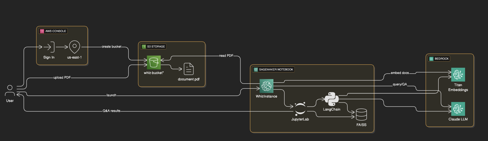
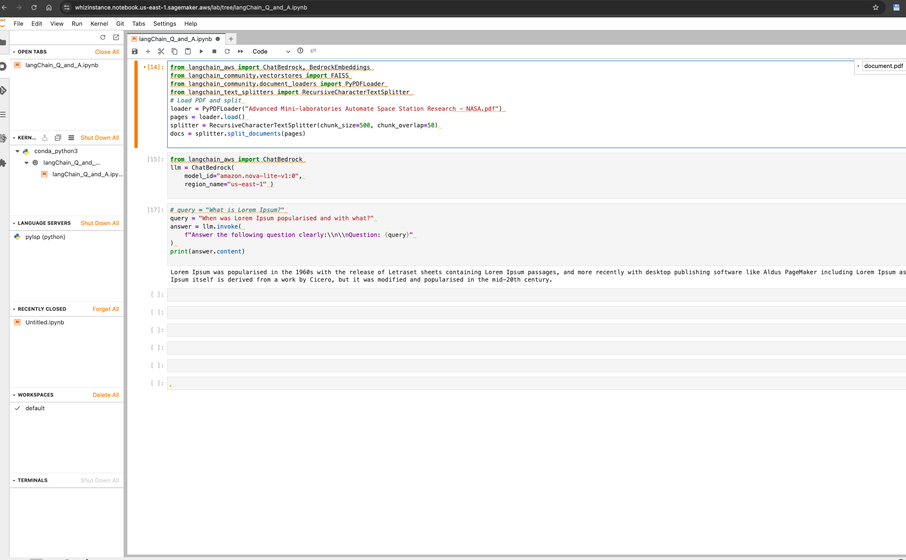

## Details:

In this lab, you will demonstrate how to build a GenAI-powered Document Q&A Bot using LangChain and AWS services. It enables users to upload documents to S3, process them with embeddings, and query them intelligently using foundation models on SageMaker. This showcases practical GenAI integration with secure, scalable cloud infrastructure.
Duration: 60 Minutes.
AWS Region: US East (N. Virginia) us-east-1.

## Introduction:

### What is Generative AI Q&A Chatbot
• The chatbot uses **Generative AI** models to read and understand documents (like PDFs) stored in S3, enabling natural language interaction with unstructured content.

• LangChain acts as the framework to combine document loading, text splitting, embedding creation, and Q&A workflows using AWS Bedrock models.

• The document is converted into vector embeddings using Amazon Titan, allowing the chatbot to semantically search relevant sections for any user question.

• All logic and AI model interactions are run within a secure, scalable Jupyter notebook in SageMaker, eliminating the need to manage infrastructure.

• Questions asked to the chatbot are answered using a Bedrock-hosted foundation model (Claude v2), ensuring intelligent, context-aware responses.

 

<h1 align="center">📝 Architecture Diagram </h1>

  

---

### Task Details:

1. Sign into the AWS Management Console.

2. Verify Bedrock Model Access

3. Create a Public S3 Bucket 

4. Upload the data in bucket

5. Launch a Sagemaker Notebook Instance

6. Configure Python Script to Run LangChain-Powered Q&A in Jupyter Notebook as,

  

