# genai-RAG-bot-langchain-aws-bedrock

## Execution Steps:
### Task 1: Sign in to AWS Management Console

1. Click on the **Open Console** button, and we will get redirected to AWS Console in a new browser tab.

2. On the AWS sign-in page,

    • Leave the **Account ID** as default. Let the 12 digit Account ID present in the AWS Console. 

    • Now copy our User Name and Password in the Console to the **IAM Username** and **Password** in AWS Console and click on the **Sign in** button.

3. Once Signed In to the AWS Management Console, Make the default AWS Region as **US East (N. Virginia) us-east-1**.

### Task 2: Create a Public S3 bucket 

In this task, we will create a s3 bucket that serves as centralized, scalable, and secure storage for documents. LangChain will access the file from here for processing.

1. Navigate to S3 by clicking on Services on the top of AWS Console and click on S3 (under Storage section) or we can also search for S3 directly. 

2. Click on **Create Bucket**. 

    • Name: Enter **whiz-bucket<RANDOM_NUMBERS>**

> Note: S3 bucket name is globally unique, choose a name which is available globally. 

<p align="center">
  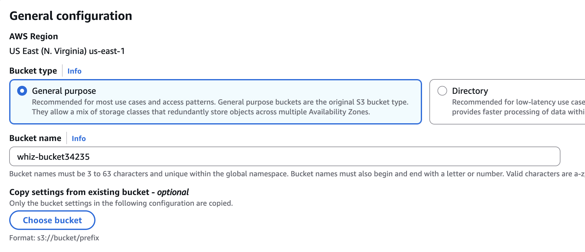
</p>

3. **Object Ownership**: Select ACLs Enabled and click on **Object Writer as Object Owner**
<p align="center">
  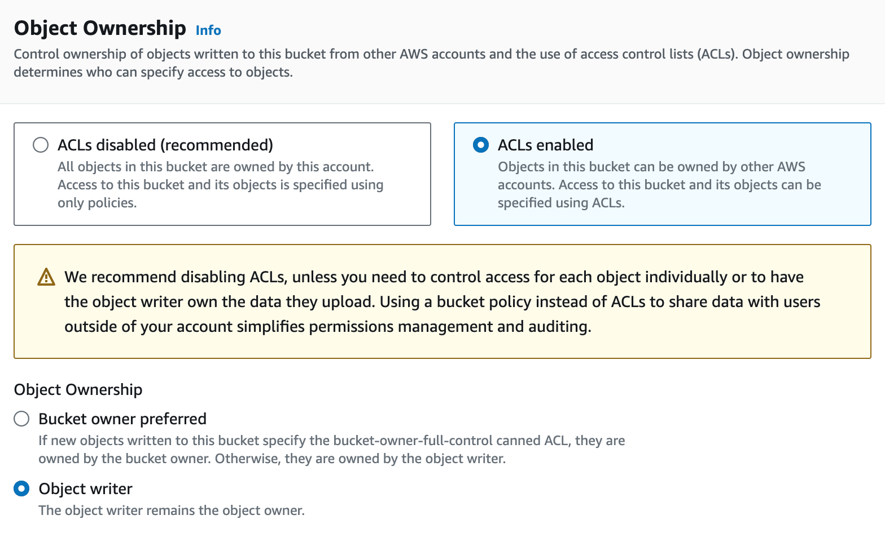
</p>

4. **Block Public Access**: Uncheck “Block all public access” and click on **acknowledge** checkbox. 

5. Leave the rest as default 
<p align="center">
  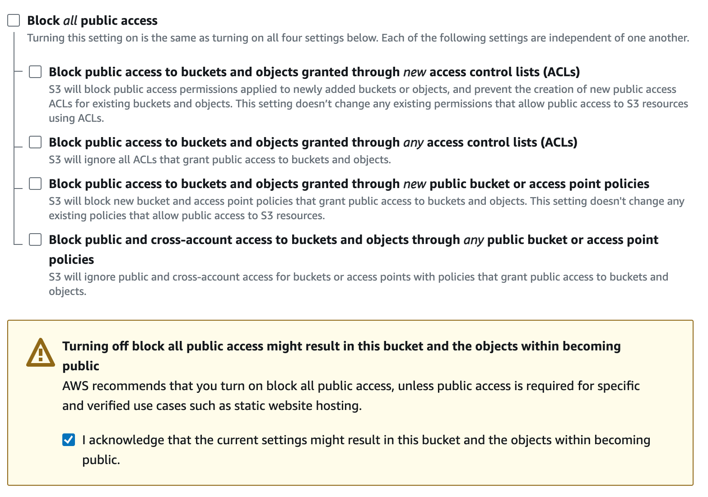
</p>

6. Now click on **Create Bucket**. 
<p align="center">
  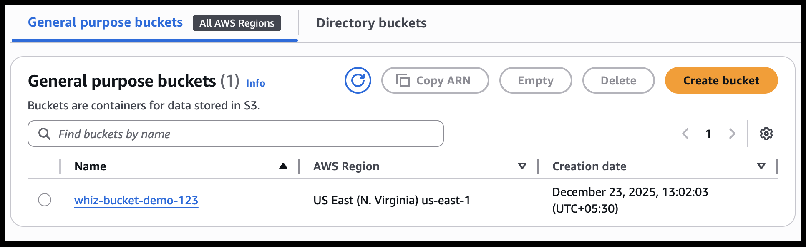
</p>

### Task 3: Upload the data in the bucket 

1. Click on **Upload** to upload the file: [source_document.pdf](data/document.pdf)

3. Now click on **Add Files**. 

4. Once we have uploaded the given data files, click on **Upload** button. 

5. Click on **Close**.
<p align="center">
  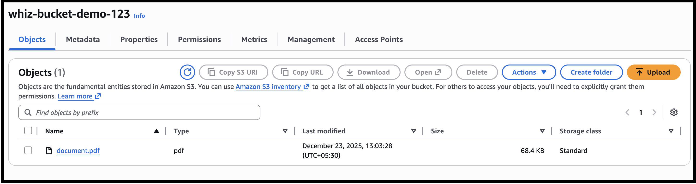
</p>

6. Select the object and navigate to **Actions** dropdown and select **Make public using ACL**. 
<p align="center">
  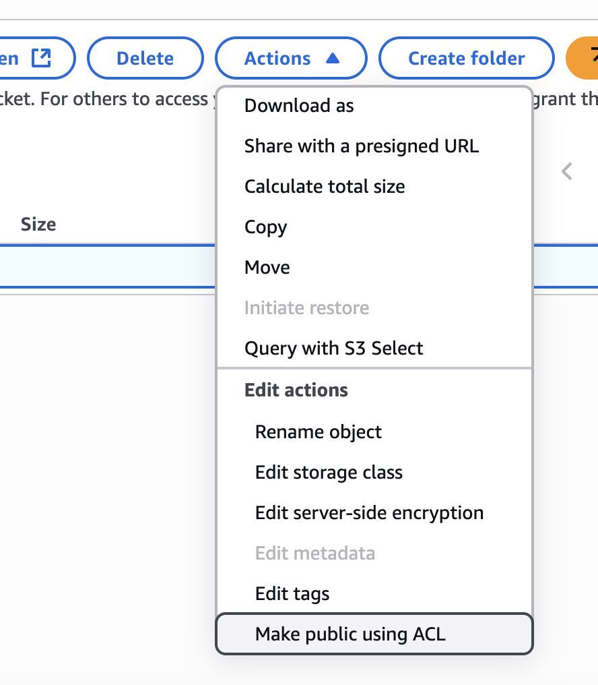
</p>

7. Finally, click on **Make Public**.  

### Task 4: Launch a Sagemaker Notebook Instance
Amazon SageMaker provides a managed environment to run ML code. We’ll use it for processing and querying the document using LangChain.

1. Make sure we are in the **US East (N. Virginia) us-east-1** Region. From the Top Search bar search for **Amazon SageMaker AI**.

2. On **SageMaker** AI Dashboard, select **Notebook** from the left menu.

3. Click on **Create notebook** instance button.  
<p align="center">
  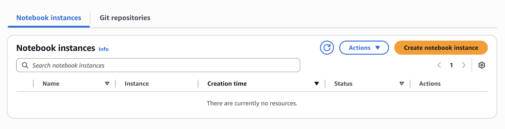
</p>

4. For notebook instance 

    • Name: **WhizInstance**

    • Notebook instance type: **ml.t3.medium** 

     • Platform Identifier: **Amazon Linux 2023, Jupyter Lab 4**

     • For IAM role select: **SageMakerInstanceRole-<RANDOM_NUMBER>**

     • Leave all the rest as default. 
     <p align="center">
    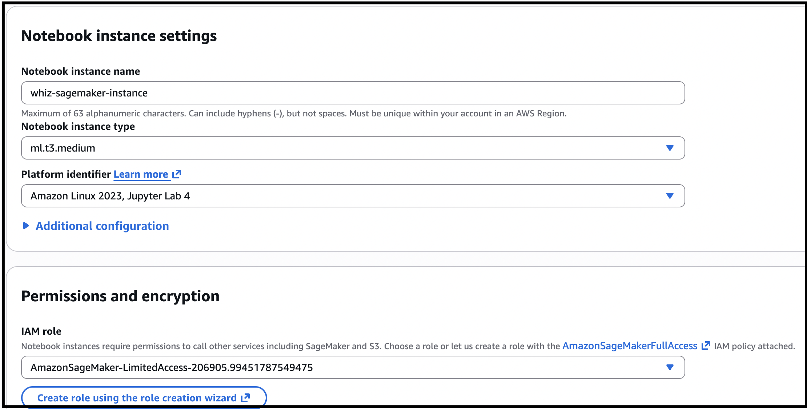
    </p>

    • Click on **Create Notebook instance button**.

5. Wait till status changes to **“InService”** as the notebook instance creation can take 5 minutes.

6. Click on **Open Jupyter** from the Actions Section for the Notebook instance.
<p align="center">
    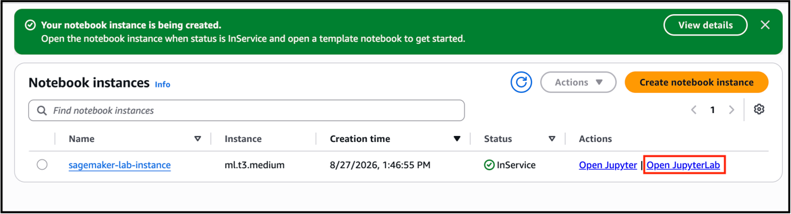
</p>

### Task 5: Configure Python Script to Run LangChain-Powered Q&A in Jupyter Notebook

1. In **JupyterLab** click on **New** button and choose **conda_python3** notebook from drop down box.
<p align="center">
    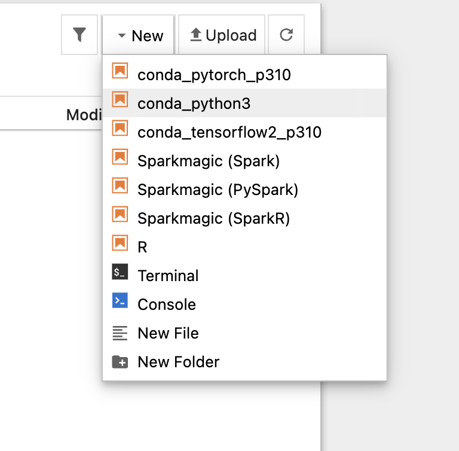
</p>

2. Paste the following code into the provided code block in the Jupyter Notebook to Install required packages.
```sh
!pip install --upgrade pip
!pip install --upgrade langchain
!pip install --upgrade langchain-community
!pip install --upgrade langchain-text-splitters
!pip install --upgrade langchain-aws
!pip install --upgrade faiss-cpu==1.7.4
!pip install --upgrade pypdf
!pip install --upgrade boto3
```
3. Click on **Run** button to run the code.  

4. If we see an **asterisk symbol (*)** inside the cell array, that means the code is executing.

5. Once the execution is completed, the **asterisk symbol will be replaced with a number**.

> Note: We can ignore the dependency resolver error.

<p align="center">
    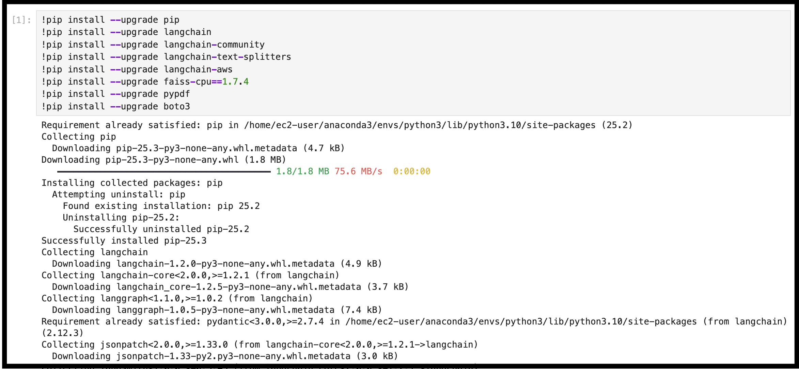
</p>

6. In a new cell, add the following code that imports all necessary libraries to build a GenAI-powered document Q&A system using LangChain, AWS Bedrock, and FAISS for embedding, loading, splitting, and querying documents.
```sh
import boto3
from langchain_community.document_loaders import PyPDFLoader
from langchain_text_splitters import RecursiveCharacterTextSplitter
from langchain_community.vectorstores import FAISS
from langchain_aws import BedrockEmbeddings, ChatBedrock
```

7. Click on **Run** button
<p align="center">
    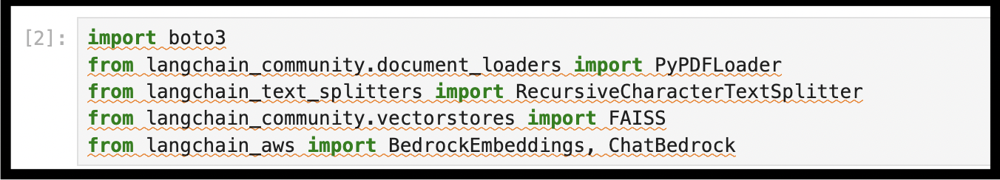
</p>

8. Add the below code in next cell to define a function to read a document from S3 bucket using boto3
```sh
import boto3

def read_s3_pdf(bucket, key, local_file="document.pdf"):
    s3 = boto3.client('s3')
    s3.download_file(bucket, key, local_file)
    return local_file
```

9. Click on **Run** button
<p align="center">
    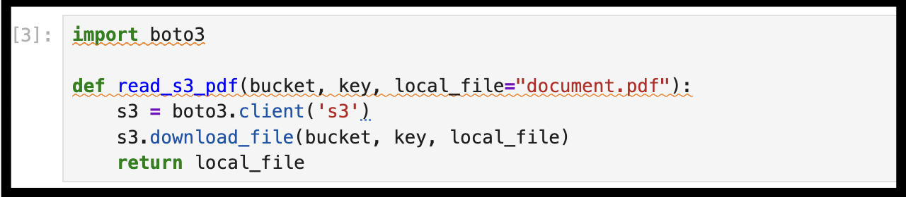
</p>

10. Add the below code in next cell to load the document content into memory from S3.

> Make sure to Update the Bucket name with your **bucket name** and Key with your **object name**.

```sh
bucket = "<your-bucket-name>"
key = "document.pdf"

local_path = read_s3_pdf(bucket, key)
print(f"Downloaded file to: {local_path}")
```

11. Click on **Run** button
<p align="center">
    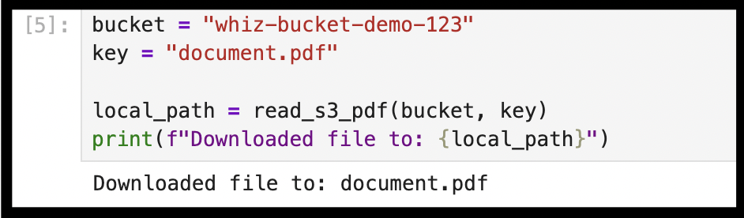
</p>

12. Add the below code in next cell to load a local PDF file, splits its content into smaller overlapping text chunks using LangChain, and prepares it for embedding or querying in a QA system.
```sh
from langchain_aws import ChatBedrock, BedrockEmbeddings
from langchain_community.vectorstores import FAISS
from langchain_community.document_loaders import PyPDFLoader
from langchain_text_splitters import RecursiveCharacterTextSplitter

# Load PDF and split
loader = PyPDFLoader("document.pdf")
pages = loader.load()

splitter = RecursiveCharacterTextSplitter(chunk_size=500, chunk_overlap=50)
docs = splitter.split_documents(pages)
```

13. Click on **Run** button
<p align="center">
    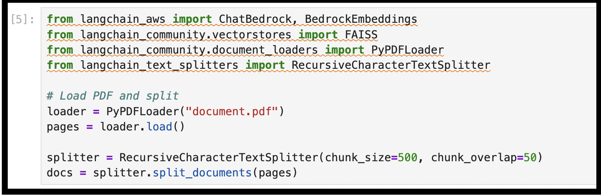
</p>

14. Add the below code in next cell to initialize the Amazon Bedrock model. It enables question answering over custom documents
```sh
from langchain_aws import ChatBedrock

llm = ChatBedrock(
    model_id="amazon.nova-lite-v1:0",  
    region_name="us-east-1"
)
```

15. Click on **Run** button
<p align="center">
    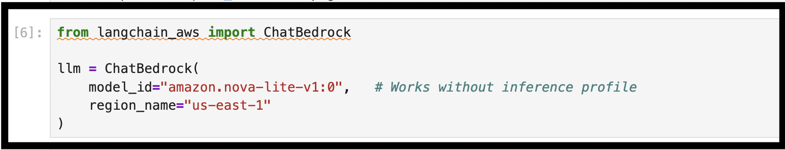
</p>

16. Add the below code in next cell to Ask a question and get an answer from the document
```sh
query = "What is Lorem Ipsum?"

answer = llm.invoke(
    f"Answer the following question clearly:\\n\\nQuestion: {query}"
)
print(answer.content)
```

17. Click on **Run** button
<p align="center">
    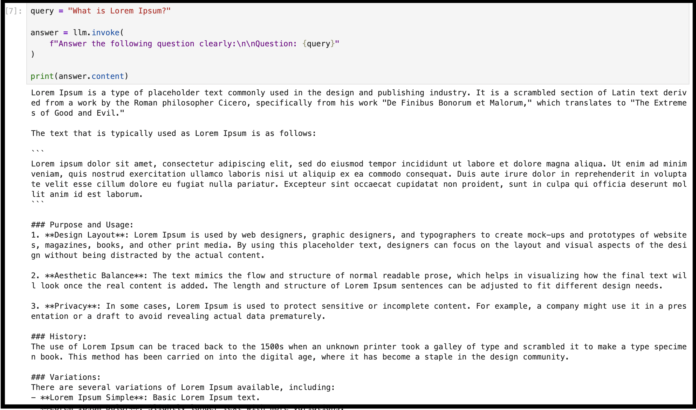
</p>

18. We can continue to ask multiple natural language questions based on the uploaded document. 

    The chatbot will retrieve relevant context from the document each time and generate accurate answers, making it ideal for interactive document exploration.


